<div align="center">

# uzair zahari

**full stack engineer** · next.js · python · go · graphql · postgresql

[](https://www.uzairzahari.com)
[](https://linkedin.com/in/uzairzahari)
[](https://medium.com/@uz6r)
[](mailto:aluzairzahari@gmail.com)
[](https://buymeacoffee.com/uzer)

</div>

---

### about

Full stack engineer with 4 years of production experience building systems that scale and survive real-world load. My stack is Next.js, TypeScript, Python, Go, GraphQL, PostgreSQL, and Temporal.

I've built and scaled high-traffic web platforms across frontend architecture, backend services, distributed workflows, and infrastructure — now doing it at GX Bank, Malaysia's first and leading digital bank.

Marathoner. TracePace turns .fit and .gpx run files into exportable posters. F1 fan, sim racer, cinephile — I believe the best engineers are never really off the clock.

Based in Petaling Jaya. Drop a message anytime.

---

<div align="center">
  
  
</div>

<div align="center">
  
</div>

---

### stack

**languages**


**frontend**


**backend & apis**


**data & infra**


**auth & observability**


**testing**


---

## things i've shipped

- ⚡ scaled a sports booking platform from **97k → 700k+ users** with 50%+ performance improvement
- 💳 payment integrations with **kiplepay** and **spay global** — error handling, retry logic, transaction monitoring
- 🔄 booking workflows in **go + temporal** — checkout, rescheduling, cancellations, refunds
- 🧾 **mylhdn e-invoice api** integration for automated b2b2c tax-compliant invoicing
- 🤖 **cloudflare turnstile** to kill bot abuse on bookings
- 🍓 full stack with **next.js + typescript** on frontend, **python + graphql strawberry + sqlalchemy** on backend
- 🥧 **raspberry pi iot** — automated venue lighting based on booking schedules
- 📋 **emergency reschedule requests** — structured workflow when self-service is unavailable, with partner centre review and email notifications

---

### career

#### GXBank — Software Engineer, Fullstack
*Jun 2026 – Present*

Contracted via MyValiant. GXBank is Malaysia's first and leading digital bank, backed by Grab and Singtel.

- Contributing to the internal operations applications supporting regional banking workflows across ASEAN.
- Delivering incremental improvements to operational tooling for the Operations team, supporting day-to-day banking processes.

#### Courtsite — Software Engineer
*Apr 2023 – May 2026*

Courtsite is a leading Progressive Web App in Malaysia that enables users to effortlessly search and book spaces for various sports. As a B2B2C aggregator platform, we foster a community of players and actively promote social games to elevate the overall playing experience.

- Architected and maintained full-stack features utilizing TypeScript-driven Next.js frontend and Python backend infrastructure with GraphQL (Strawberry), SQLAlchemy, and PostgreSQL.
- Spearheaded development of the flagship "Book" feature, empowering users to seamlessly discover and reserve venues through intelligent real-time filtering across time slots, locations and sport categories.
- Engineered robust third-party payment integrations with KiplePay and SPay Global, implementing sophisticated error handling, retry mechanisms, and comprehensive transaction monitoring for seamless operations.
- Developed high-performance backend services in Go for mission-critical booking workflows encompassing checkout processes, dynamic rescheduling and external API integrations, leveraging Temporal for workflow orchestration.
- Implemented Cloudflare Turnstile security integration to combat automated booking exploitation, significantly reducing fraudulent bot activity and protecting platform integrity.
- Drove platform scalability initiatives supporting explosive user growth from 97,000 to 800,000+ users, delivering strategic backend optimizations and UX enhancements that accelerated performance by over 50%.
- Implemented MyLHDN e-Invois API integration to streamline automated generation of tax-compliant invoices for B2B2C operator partnerships.
- Led technical mentorship and developer onboarding programs through comprehensive code reviews, system architecture walkthroughs and documentation standardization.

---

### side projects

#### TracePace ⚡

> momentum turned into modern art.

gps activity visualization platform that transforms `.fit` and `.gpx` files into minimalist, gallery-quality poster art for athletes. built with **go + next.js** monorepo.


```text
    status    : launched
    version   : v1.0.0
    url       : [tracepace.app](https://tracepace.app)
    tech      : golang · graphql · next.js · framer-motion
features  : rdp path simplification · elevation charts · weather integration
```

- parses fit/gpx with custom go binary parser
- ramer-douglas-peucker algorithm for clean vector traces
- multiple poster themes (world marathon majors + local races)
- high-res png export (3:4, 1:1, 16:9 aspect ratios)

> repo is private & invitational. hit me up if you're interested in collaborating.

---

### writing

i write on medium about engineering, careers, and working in tech. occasionally about training too — distance running, lifting, hyrox. trying to get better at both, not just one.

- [i train in blocks, i build the same way](https://medium.com/@uz6r/i-train-in-blocks-i-build-the-same-way-e1c496e0863b) · 2026
- [i don't know enough yet to keep it simple](https://medium.com/@uz6r/i-dont-know-enough-yet-to-keep-it-simple-d9b650dd08a6) · jan 2026

---

### currently

```
    location  : petaling jaya, malaysia
    role      : software engineer, fullstack @ gxb
    exploring : systems design, distributed workflows, iot
    training  : marathons, lifting, working towards hyrox
```

---

<div align="center">

*building things that don't break under pressure.*

</div>