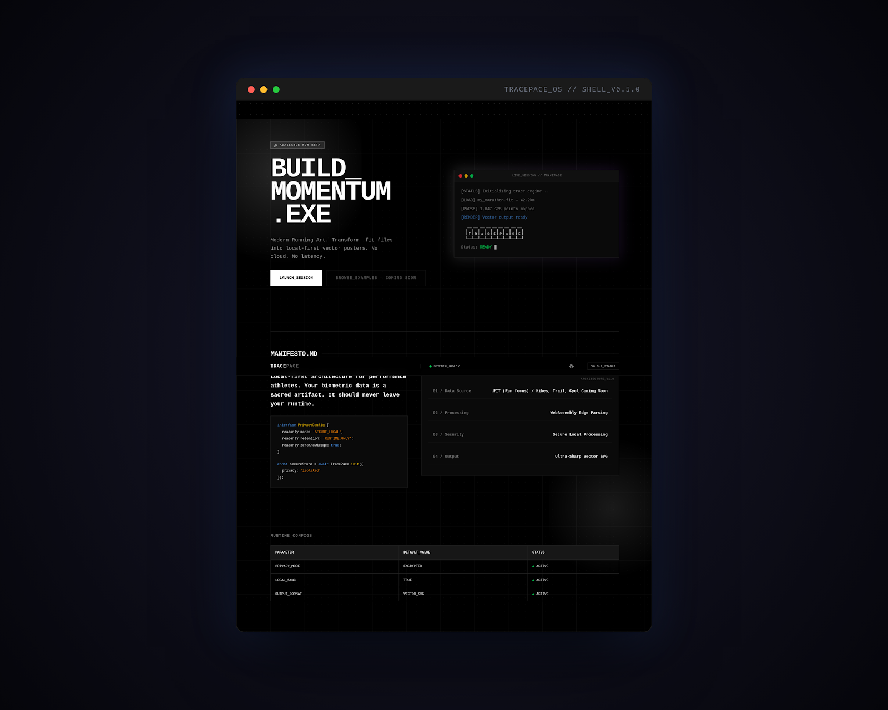

<div align="center">

# uzair zahari

**full stack engineer** · next.js · python · go · graphql · postgresql

[](https://www.uzairzahari.com)
[](https://linkedin.com/in/uzairzahari)
[](https://medium.com/@uz6r)
[](mailto:aluzairzahari@gmail.com)
[](https://buymeacoffee.com/uzer)

</div>

---

### about

building things that bridge digital fitness data and tangible art. working on [tracepace](#side-projects) — a platform that transforms gps activity files into minimalist poster art for athletes.

also a full stack engineer at courtsite.

---

### stack

**languages**


**frontend**


**backend & apis**


**data & infra**


**auth & observability**


**testing**


---

### things i've shipped

- ⚡ scaled a sports booking platform from **97k → 700k+ users** with 50%+ performance improvement
- 💳 payment integrations with **kiplepay** and **spay global** — error handling, retry logic, transaction monitoring
- 🔄 booking workflows in **go + temporal** — checkout, rescheduling, cancellations, refunds
- 🧾 **mylhdn e-invoice api** integration for automated b2b2c tax-compliant invoicing
- 🤖 **cloudflare turnstile** to kill bot abuse on bookings
- 🍓 full stack with **next.js + typescript** on frontend, **python + graphql strawberry + sqlalchemy** on backend
- 🥧 **raspberry pi iot** — automated venue lighting based on booking schedules

---

### side projects

#### TracePace ⚡

> momentum turned into modern art.

gps activity visualization platform that transforms `.fit` and `.gpx` files into minimalist, gallery-quality poster art for athletes. built with **go + next.js** monorepo.



```text
status    : public beta incoming
version   : v0.5.0-alpha
tech      : golang · graphql · next.js · framer-motion
features  : rdp path simplification · elevation charts · weather integration
```

- parses fit/gpx with custom go binary parser
- ramer-douglas-peucker algorithm for clean vector traces
- multiple poster themes (world marathon majors + local races)
- high-res png export (3:4, 1:1, 16:9 aspect ratios)

> repo is private & invitational. hit me up if you're interested in collaborating.

---

### writing

i write on medium about engineering, careers, and working in tech. occasionally about training too — distance running, lifting, hyrox. trying to get better at both, not just one.

- [i don't know enough yet to keep it simple](https://medium.com/@uz6r/i-dont-know-enough-yet-to-keep-it-simple-d9b650dd08a6) · jan 2026
- [playing the long game in a sprint-obsessed industry](https://medium.com/@uz6r/playing-the-long-game-in-a-sprint-obsessed-industry-17e37bbf20b1) · nov 2025

---

### currently

```
location  : petaling jaya, malaysia
role      : software engineer, full stack @ courtsite
exploring : systems design, distributed workflows, iot
training  : marathons, lifting, working towards hyrox
open to   : interesting problems
```

---

<div align="center">

*building things that don't break under pressure.*

</div>